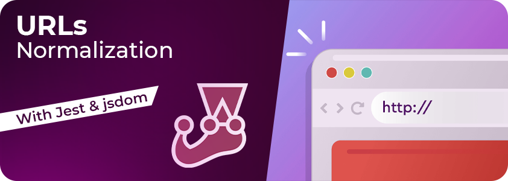
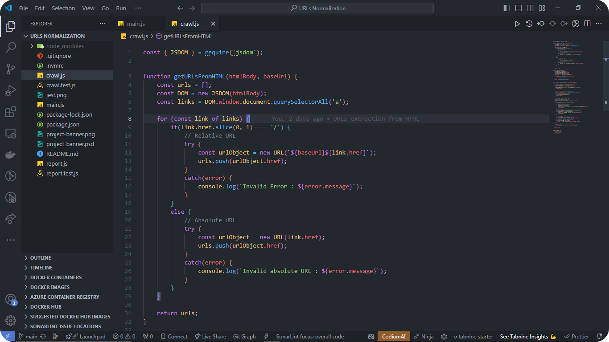
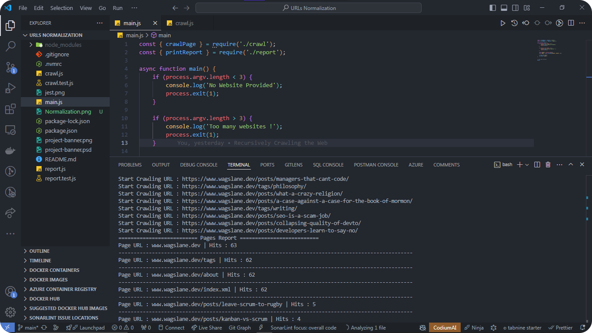

# URLs-Normalization-Jest
This project focuses on the implementation and testing of a URL normalization process using Jest, a popular JavaScript testing framework. URL normalization involves converting URLs to a standard format to ensure consistency and reliability when processing web addresses.

## Details

The key areas of this project include:

- Handling Capitals: Convert all characters in the URL to lowercase to avoid case sensitivity issues.

- Removing Trailing Slashes: Standardize URLs by removing unnecessary trailing slashes, ensuring uniformity across different URL variations.

- Extracting Paths: Parse URLs to extract and normalize the path segments, enabling easier comparison and manipulation.

- Parsing HTML for URLs: Extract URLs from HTML content, normalize them, and ensure they conform to the desired format.

## Demo

Normalizing URLs to standardize protocols, domain names, and path structures, and more

Extracting URLs from HTML pages for data collection, indexing, and more.

## Contact

[LinkedIn](https://www.linkedin.com/in/akhatarmourad/)
